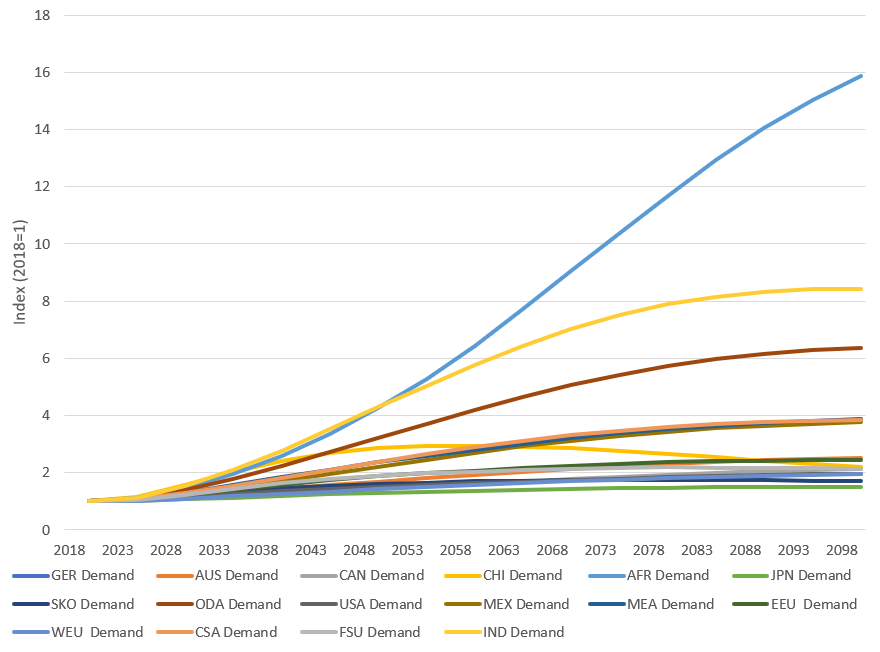

## Agriculture

The agricultural sector (AGR) is mapped on the basis of IEA data sheets and data on fuels used and resulting emissions. 
For the agricultural sector, a proportional relationship between production of agricultural products and the demand for energy services is assumed. In principle, the modelling of the agricultural sector only covers its energy use. Figure 1 shows the predicted demand for energy services in TIAM regions of the world with 2018 as the base year up to 2100. The base year of the agricultural sector is calibrated using the IEA energy balance.
 
 

Figure 1 Demand projection for agriculture.

The demand for energy services is modelled using various energy sources. The proportion of the energy sources is determined from the base year using the IEA energy balance. Due to the fact that process changes are possible to a limited extent, the modelling of the agricultural sector only includes the possibility of adjusting the specific energy demand. The choice between different technologies and energy sources is not possible. The fuel technologies used in the agricultural sector are divided into 12 categories whereby the aggregation ratios are based on the IEA database. The IEA energy balance distinguishes between 13 raw materials used in the agricultural sector. Here the fuel consumption refers to the complete agricultural activities.
At the technology level, the base year and new technologies are distinguished. Base year technologies represent all technologies available for 2015 base year. Advanced efficiency technologies can be added on the basis of available new technologies over time.
